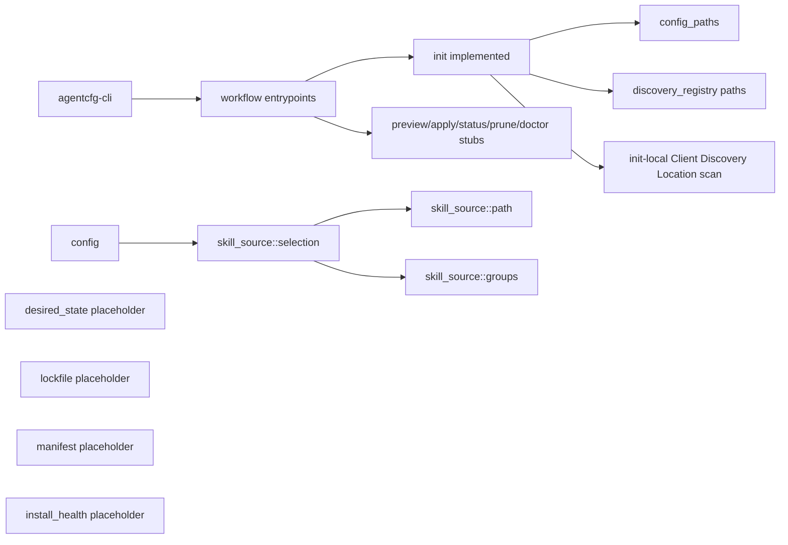
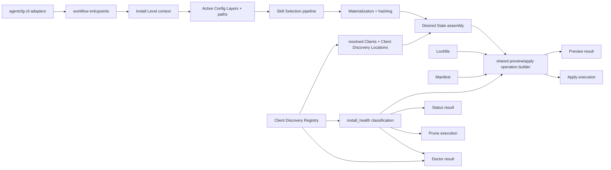

# agentcfg V1 Architecture Synthesis

This note preserves the architecture synthesis from four independent review runs. It is the rationale companion to [implementation-plan-v1.md](implementation-plan-v1.md): the implementation plan remains milestone-oriented, while this note records the richer ownership model, consensus, and constraints that should guide the remaining V1 work.

Source reports:

| Label | Source |
| --- | --- |
| Cursor run A | `/private/tmp/cursor-improve-codebase.html` |
| Cursor run B | `/private/var/folders/6w/52q5tjyd6s7dh19nl44jby4h0000gn/T/architecture-review-20260528.html` |
| GPT-5.5 high run C | `/var/folders/6w/52q5tjyd6s7dh19nl44jby4h0000gn/T/architecture-review-20260528-172253.html` |
| GPT-5.5 xhigh run D | `/private/var/folders/6w/52q5tjyd6s7dh19nl44jby4h0000gn/T/architecture-review-20260528-174355.html` |

The source HTML files are evidence, not repo-owned artifacts. This Markdown note is the durable source of truth.

## Synthesis

The shared shape is a pipeline, not a set of isolated refactors. Workflows should stay thin adapters. Deeper modules should own Install Level setup, Skill Selection output, Client Discovery Registry resolution, Desired State assembly, operation building, and install-health classification.

```text
Install Level context
  -> Skill Selection pipeline
  -> Desired State assembly
  -> Preview Operation builder
  -> Apply / Status / Prune

Client Discovery Registry
  -> Desired State assembly
  -> install_health classification

install_health classification
  -> Apply / Status / Prune / Doctor
```

## Before / After Structure

### Before: current state recorded at Task M2.3

The current implementation state is after **Task M2.3: Resolve Skill Source-local Skill Groups**. M2.4 and later tasks are pending. M1.6.4 still has follow-ups for `--client` and explicit client validation.

Current core shape:

```text
crates/agentcfg-core/src/
  config.rs                    # Skill Configuration parsing and validation
  config/tests.rs
  config_paths.rs              # config, lockfile, Managed State path formulas
  desired_state.rs             # placeholder terms only
  discovery_registry.rs        # private grouped Client Discovery Location paths
  error.rs
  install_health.rs            # placeholder terms only
  layer_level.rs
  lockfile.rs                  # placeholder module docs only
  manifest.rs                  # placeholder module docs only
  skill_source/
    mod.rs
    path.rs                    # path Skill Source discovery
    groups.rs                  # root skills.toml Skill Group metadata
    selection.rs               # include/group Skill Selection and diagnostics
  workflow/
    context.rs                 # process cwd + UserDirs adapter
    init.rs                    # init orchestration plus Unmanaged Artifact scan
    mod.rs                     # workflow stubs except init
    types.rs                   # workflow request/result DTOs
```

Current high-level flow:



Current friction:

- `workflow::init` owns Client Discovery Location scanning that later workflows also need.
- `WorkflowContext` hides process environment lookup but does not yet resolve an active Install Level context.
- `discovery_registry` returns grouped paths, but does not yet own Client resolution/filtering.
- `desired_state`, `lockfile`, `manifest`, and `install_health` are placeholders.
- `skill_source::selection` is the deepest implemented module, but M2.4 will add Discovery Name output and needs staging to avoid becoming too wide.

### After: target structure when V1 is complete

The final V1 structure should keep workflow entrypoints thin and concentrate policy in the modules that can hide it best.

Target core shape:

```text
crates/agentcfg-core/src/
  config.rs
  config_paths.rs
  desired_state/
    mod.rs                     # fan-in from prepared skill facts + resolved Clients
    skill.rs                   # V1 skill desired Installed Artifact intent
    tests.rs
  discovery_registry/
    mod.rs                     # Client catalog and path definitions
    resolution.rs              # clients = "all" and --client filtering
    tests.rs
  install_health/
    mod.rs                     # current-state classification
    tests.rs
  lockfile.rs
  manifest.rs
  operations/
    mod.rs
    preview.rs                 # shared preview/apply operation entries
    apply.rs                   # apply operation execution helpers
    prune.rs                   # prune operation execution helpers
  skill_source/
    mod.rs
    path.rs
    groups.rs
    selection/
      mod.rs                   # public Skill Selection seam
      aliases.rs               # Skill Alias and Discovery Name output
      diagnostics.rs
  materialization/
    mod.rs                     # safe tree walk, symlink materialization, hashing
    hashing.rs
  workflow/
    context.rs                 # process/env adapter
    install_context.rs         # Active Config Layers, paths, Managed State
    init.rs
    preview.rs
    apply.rs
    prune.rs
    status.rs
    doctor.rs
    types.rs                   # split further only when result size justifies it
```

Names are illustrative, not binding. The required shape is the ownership split: Install Level context, Client Discovery Registry, Skill Selection, Desired State, operation builder, and install-health classification each own distinct policy.

Target high-level flow:



Final V1 ownership checks:

- `workflow/*` orchestrates only; it does not own Skill Selection, Client resolution, operation diffing, filesystem classification, or terminal rendering.
- `skill_source` produces prepared skill facts, including Discovery Names, but not Discovery Name Collision results.
- `discovery_registry` owns Client resolution and Client Discovery Location resolution.
- `desired_state` turns prepared skill facts plus resolved Client facts into desired Installed Artifact intent.
- `operations` compares Desired State with current Lockfile/Manifest state and reports diffs, including Discovery Name Collisions.
- `install_health` classifies current filesystem/Manifest/Managed State facts for Apply, Prune, Status, and Doctor.
- `agentcfg-cli` renders structured results and maps exit codes.

## Consensus Matrix

| Theme | Cursor A | Cursor B | GPT-5.5 high C | GPT-5.5 xhigh D | Consensus | Combined reading |
| --- | --- | --- | --- | --- | --- | --- |
| Desired State assembly | Strong | Strong | Strong | Strong | High | Central fan-in for prepared Skill Selection output, resolved Client facts, Discovery Requirements, and Installed Artifact intent. |
| Client Discovery Location inspection / install-health classification | Worth exploring | Worth exploring | Worth exploring | Strong | High | `init` should not own scan/classification policy once Status, Doctor, Apply, and Prune need the same facts. |
| Skill Selection staging | Speculative | Strong | Worth exploring | Strong | High | M2.4 should add Discovery Name output without bloating one file or widening the public interface. |
| Install Level context / Active Config Layers session | Folded into Desired State | Strong | Strong | Worth exploring | Medium-high | Keep environment and path policy out of Desired State. |
| Client resolution | Worth exploring | Worth exploring | Folded into Desired State | Strong | High | Client Discovery Registry should expand `clients = "all"`, validate `--client`, map Clients to Client Discovery Locations, and keep confidence provenance. |
| Preview Operation builder | Strong | Not called out | Implied by Desired State | Implied by Desired State | Medium | `design-v1.md` explicitly says Preview and Apply should share one operation builder. |
| Workflow diagnostics | Not called out | Not called out | Speculative | Worth exploring | Medium | Real concern, but wait until preview/apply/status result shapes are concrete. |
| Filesystem walk policy | Not called out | Speculative | Not called out | Not called out | Low | Defer until M3 materialization proves shared traversal primitives reduce caller complexity. |

## Ownership Model

### Install Level Context

Owns:

- Install Level to Active Config Layers policy
- Project Root discovery
- Config file and lockfile paths
- Managed State paths
- User path environment via `UserDirs`

Does not own:

- Client Discovery Location resolution
- Skill Source resolution
- Desired State construction

Client Discovery Registry resolves Client Discovery Locations for selected Clients and Install Levels.

### Client Discovery Registry

Owns:

- supported Client catalog
- Client Discovery Location definitions
- confidence/provenance metadata
- `clients = "all"` expansion
- `--client` filtering and validation
- mapping Clients to Client Discovery Locations

Does not own:

- Desired State assembly
- Manifest ownership checks
- terminal rendering

### Skill Selection Pipeline

Owns:

- source inventory facts
- Included Skill and Skill Group selection
- Skill Alias application
- Discovery Name-bearing selected output
- deterministic selected output ordering

Does not own:

- Discovery Name Collision detection, which requires Client Discovery Location context
- materialization and hashing
- Desired State assembly

### Desired State Assembly

Owns:

- fan-in from Active Config Layers, prepared Skill Selection output, resolved Client facts, Managed Skill Content path facts, and Discovery Requirements
- desired Installed Artifact intent
- enough provenance for operation building and diagnostics

Does not own:

- Skill Alias application
- Client Discovery Location resolution
- filesystem environment policy
- diff generation or collision reporting

### Preview Operation Builder

Owns:

- comparing Desired State to lockfile and Manifest state
- lockfile create/update operation records
- Installed Artifact create/update operation records
- Discovery Requirement addition records
- stale reporting records
- Discovery Name Collision detection and reporting

Does not own:

- terminal rendering
- filesystem mutation
- config loading

### install_health

Owns:

- Unmanaged Artifact classification
- Broken Symlink and Unexpected Symlink Target facts
- missing Managed Skill Content facts
- Stale Discovery Requirement and Stale Installed Artifact facts
- current-state facts consumed by Apply, Prune, Status, and Doctor

Does not own:

- Desired State assembly
- operation diff generation
- terminal rendering

## Coherent Execution Order

1. Build active Install Level context.
2. Deepen Client Discovery Registry.
3. Stage Skill Selection for Discovery Names.
4. Build Desired State assembly.
5. Build shared Preview/Apply operation entries.
6. Move install-health classification out of `init`, in parallel where possible.

Desired State is central, but it should not be first in isolation. It needs stable inputs from Install Level context, Client Discovery Registry, and Skill Selection.

## V1 Plan Implications

- M2.4 should be framed as Skill Selection staging for Discovery Names.
- Client resolution and filtering should be split out of Desired State work.
- Desired State should be a fan-in module, not a catch-all owner for Skill Alias, Client, or path policy.
- Operation building should remain structured and free of terminal formatting.
- Apply, Prune, Status, and Doctor should consume install-health facts instead of rescanning Client Discovery Locations independently.
- Keep workflow entrypoints as adapters.

## Beyond V1

The synthesis supports later Configured Item kinds if shared seams start after kind-specific resolution:

```text
Skill resolver             -> Desired State entries
MCP resolver               -> Desired State entries
Rules resolver             -> Desired State entries
Agent definition resolver  -> Desired State entries

Desired State + current state -> shared operation builder
```

Keep these constraints:

- Specific resolvers own their own config parsing, validation, external-origin resolution, and kind-specific safety rules.
- Shared preview/apply/status/prune machinery begins after resolvers produce structured Desired State entries.
- Do not introduce generic Configured Item manager traits in V1.
- Do not force future Configured Item kinds into the skill Installed Artifact model.

## Do Not Change

- Do not move terminal rendering into core workflow or operation-builder modules.
- Do not introduce generic Configured Item manager traits before a second Configured Item kind exists.
- Do not unify filesystem walk policy before M3 materialization proves a second walk needs shared primitives.
- Do not add new glossary terms for implementation modules; existing CONTEXT.md terms cover the domain.
