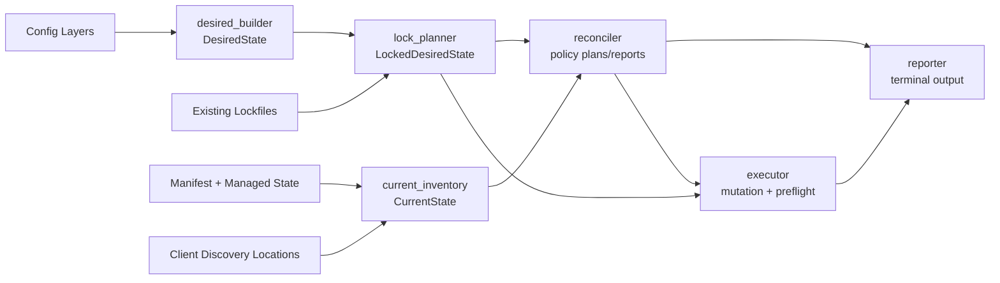
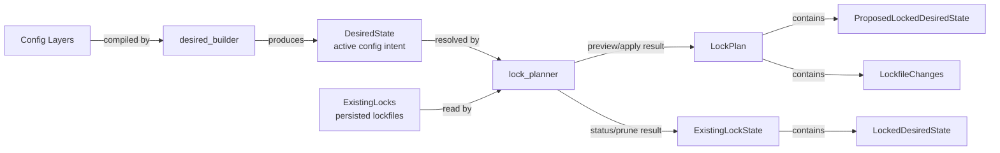
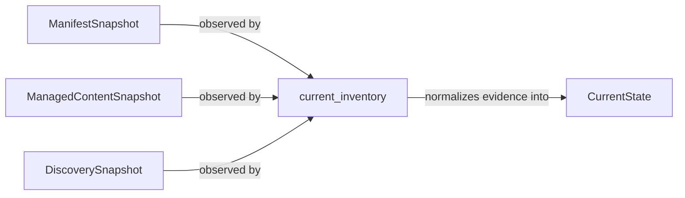
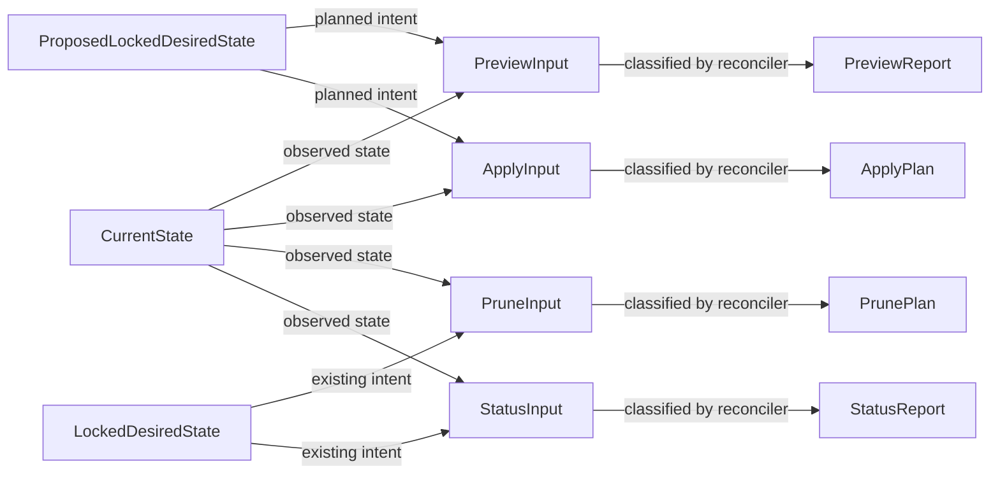
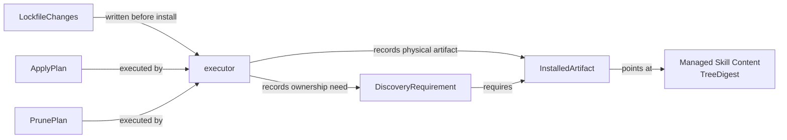
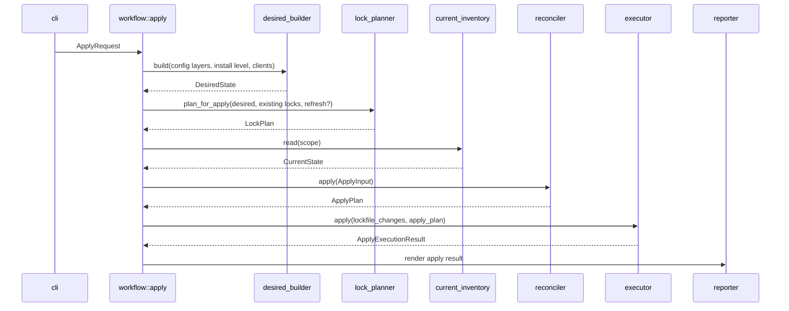

# V1 Design

## Thesis

V1 uses a bounded reconciler architecture. The reconciler is a deep policy module that compares normalized locked desired state with normalized current state and returns command-specific plans or reports. It does not resolve Skill Sources, write files, or know lockfile persistence details.

The design keeps generic infrastructure out of V1. V1 manages Skills. Future item kinds, such as Agents, can be added as typed resource groups above or beside Skills without turning the V1 reconciler into a generic resource graph.

The design is lightly inspired by `kubectl apply`'s declarative comparison of desired configuration with live state, while keeping pruning as an explicit separate command. It is also inspired by Cargo's lockfile model: resolve first, persist the lock, then perform work against that persisted resolution. References: [Kubernetes declarative object management](https://kubernetes.io/docs/tasks/manage-kubernetes-objects/declarative-config/) and [cargo generate-lockfile](https://doc.rust-lang.org/cargo/commands/cargo-generate-lockfile.html).

Core split:

| Module | Role |
| --- | --- |
| `desired_builder` | Compiles active config intent into `DesiredState`. |
| `lock_planner` | Resolves `DesiredState` plus existing lockfiles into proposed or existing locked state. |
| `current_inventory` | Normalizes filesystem, Manifest, Managed State, and discovery-location evidence into `CurrentState`. |
| `reconciler` | Compares locked desired state with current state and returns command policy results. |
| `executor` | Applies approved mutation plans to lockfiles, Managed State, discovery locations, and Manifest records. |
| `reporter` | Renders structured command results as terminal output. |

The diagram below shows the high-level data flow between those modules. It is a conceptual overview; command-specific details are covered in the command flow sections.



## Module Layout

Recommended Rust module layout:

```text
crates/agentcfg-cli/src/
  main.rs                 CLI entrypoint
  args.rs                 argument parsing into command requests
  output.rs               terminal rendering adapters
  exit_codes.rs           central exit-code mapping

crates/agentcfg-core/src/
  workflow/
    init.rs               command use case
    preview.rs            command use case and command-plan composition
    apply.rs              command use case and command-plan composition
    prune.rs              command use case and command-plan composition
    status.rs             command use case and command-report composition
    doctor.rs             readiness diagnostics

  desired_builder.rs      config intent -> DesiredState
  lock_planner.rs         DesiredState + locks -> locked/proposed locked state
  current_inventory.rs    filesystem + Manifest evidence -> CurrentState
  reconciler/
    mod.rs                public command-shaped entrypoints
    classifiers.rs        private shared classification logic
    preview.rs            PreviewReport shaping
    apply.rs              ApplyPlan shaping
    prune.rs              PrunePlan shaping
    status.rs             StatusReport shaping

  executor/
    mod.rs                public apply/prune execution interface
    apply.rs              apply preflight and write ordering
    prune.rs              prune preflight and removal ordering

  state/
    desired.rs            DesiredState and skill desired resources
    locked.rs             LockedDesiredState and proposed locked resources
    current.rs            CurrentState and normalized observations

  manifest.rs             Manifest model
  lockfile.rs             persisted lockfile model
  config.rs               parsed config model
  client_registry.rs      supported clients and discovery locations
  content_digest.rs       deterministic tree digest
  stores/
    config_store.rs       config file reads/writes
    lock_store.rs         lockfile reads/writes
    manifest_store.rs     Manifest reads/writes
    managed_content.rs    content-addressed Managed Skill Content writes
    discovery_store.rs    discovery symlink operations
  fs/
    filesystem_probe.rs   path kind, symlink, writability, directory facts
```

The layout is intentionally not one module per PRD noun. Modules exist where they hide policy, normalize evidence, preserve persistence ownership, or reduce caller burden.

## CLI Layout

V1 keeps the CLI thin. It parses flags into typed command requests, calls the matching `workflow` use case, renders the result, and maps it to an exit code. It does not perform orchestration, source resolution, reconciliation, or filesystem mutation directly.

Command surface:

```text
agentcfg init [--project | --user]

agentcfg preview [--user] [--refresh-sources] [--client <client>...]
agentcfg apply   [--user] [--refresh-sources] [--client <client>...]

agentcfg prune   [--user] [--client <client>...]
agentcfg status  [--user] [--client <client>...]

agentcfg doctor
```

Request types:

```text
InitRequest {
  target_layer: UserProject | SharedProject | User,
}

PreviewRequest {
  install_level: Project | User,
  refresh_sources: bool,
  clients: ClientSelector,
}

ApplyRequest {
  install_level: Project | User,
  refresh_sources: bool,
  clients: ClientSelector,
}

PruneRequest {
  install_level: Project | User,
  clients: ClientSelector,
}

StatusRequest {
  install_level: Project | User,
  clients: ClientSelector,
}

DoctorRequest {}
```

CLI flag rules:

- Default `init` creates User Project Config.
- `init --project` creates Shared Project Config.
- `init --user` creates User Config.
- Default `preview`, `apply`, `prune`, and `status` run at Project Level.
- `--user` selects User Level for `preview`, `apply`, `prune`, and `status`.
- `doctor` has no `--user` because it checks environment/config/tooling readiness rather than one install level.
- `--refresh-sources` is accepted only by `preview` and `apply`.
- `--client <client>` may repeat and only narrows configured clients. It does not add clients outside configured selection unless config uses `clients = "all"`.

Workflow mapping:

```text
agentcfg init     -> workflow::init::run(InitRequest)
agentcfg preview  -> workflow::preview::run(PreviewRequest)
agentcfg apply    -> workflow::apply::run(ApplyRequest)
agentcfg prune    -> workflow::prune::run(PruneRequest)
agentcfg status   -> workflow::status::run(StatusRequest)
agentcfg doctor   -> workflow::doctor::run(DoctorRequest)
```

Output responsibilities:

- `workflow` returns structured command reports/results.
- `agentcfg-cli` renders terminal output from those structures.
- Exit code mapping stays centralized in `exit_codes.rs`.
- CLI help and diagnostics use PRD terms: Config Layer, Install Level, Skill Source, Client Discovery Location, Managed State, Manifest, Discovery Requirement, Installed Artifact, and Discovery Name Collision.

## State Shapes

Use typed aggregate state, not optional future bags.

```text
DesiredState {
  skills: DesiredSkillResources,
}

CurrentState {
  skills: CurrentSkillResources,
}
```

If V2 adds Agents, extend the aggregate:

```text
DesiredState {
  skills: DesiredSkillResources,
  agents: DesiredAgentResources,
}
```

The reconciler may remain the command-level coordinator, but lifecycle policy should stay item-specific internally until multiple item kinds prove a shared abstraction.

## Data Structure Concept Islands

These diagrams split the main data structures by ownership. They are about data relationships, not exact function call order.

### Intent And Locking



### Current-State Inventory



### Reconciliation Inputs And Outputs



### Execution And Manifest State



## Desired And Locked State

`DesiredState` is active config intent before Skill Source resolutions are fixed.

`LockedDesiredState` is normalized desired install state derived from existing lockfiles. It is used by `status` and `prune`.

`ProposedLockedDesiredState` is the in-memory locked outcome produced by `preview` and `apply` after source/lock planning. It may include missing lockfile creation or refreshed source resolutions. `preview` never persists it. `apply` recomputes it at apply time and persists lockfile changes before installing.

The reconciler receives normalized locked install state, not lockfile schema.

```text
LockedDesiredState {
  skills: LockedDesiredSkillResources,
}
```

The normalized skill resources include desired Managed Skill Content, desired Installed Artifacts, and desired Discovery Requirements.

## Command Composition Types

Command use cases compose lock planning, reconciliation, execution, and reporting through command-level types. These types keep lockfile/source diagnostics outside the reconciler while still giving reporters one coherent command result.

```text
LockPlan {
  proposed_locked: ProposedLockedDesiredState,
  lockfile_changes: Vec<LockfileChange>,
  diagnostics: Vec<LockDiagnostic>,
  fatal_diagnostics: Vec<FatalDesiredStateDiagnostic>,
}

ExistingLockState {
  locked: LockedDesiredState,
  diagnostics: Vec<LockDiagnostic>,
  fatal_diagnostics: Vec<FatalDesiredStateDiagnostic>,
}

PreviewCommandPlan {
  lock_plan: LockPlan,
  install_preview: PreviewReport,
}

ApplyCommandPlan {
  lockfile_changes: Vec<LockfileChange>,
  apply_plan: ApplyPlan,
}

PruneCommandPlan {
  existing_lock_state: ExistingLockState,
  prune_plan: PrunePlan,
}

StatusCommandReport {
  existing_lock_state: ExistingLockState,
  install_status: StatusReport,
}
```

`LockDiagnostic` includes non-fatal source-resolution and config/lock mismatch diagnostics. Fatal desired-state diagnostics stop before inventory/reconciliation.

## Module Responsibilities

### `desired_builder`

Builds active config intent.

```text
desired_builder.build(config_layers, install_level, client_filter) -> DesiredState
```

Owns:

- active Config Layer selection
- Project Level vs User Level separation
- `--client` narrowing
- `clients = "all"` expansion
- configured Skill Sources, selections, groups, and aliases
- config-level collision checks knowable without resolving sources

Does not inspect git/path source contents, read discovery locations, or decide install state.

### `lock_planner`

Derives locked state from config intent and existing lockfiles.

```text
lock_planner.plan_for_preview(desired, existing_locks, refresh_sources) -> LockPlan
lock_planner.plan_for_apply(desired, existing_locks, refresh_sources) -> LockPlan
lock_planner.existing_for_status(desired, existing_locks) -> ExistingLockState
lock_planner.existing_for_prune(desired, existing_locks) -> ExistingLockState
```

Owns:

- existing lock reuse
- missing lockfile creation planning
- `--refresh-sources`
- path and git Skill Source resolution
- source-resolution diagnostics
- config/lock mismatch diagnostics
- resolved Discovery Name Collision detection after source resolution

Does not read current install state or decide apply/prune policy.

### `current_inventory`

Reads current evidence and normalizes it into `CurrentState`.

```text
current_inventory.read(scope) -> CurrentState
```

It scans entire selected Client Discovery Locations, not only desired paths. Scope is still limited to the active install level and selected clients.

Owns observable facts:

- Manifest records
- Managed Skill Content existence
- discovery path entries
- unmanaged artifacts
- symlink targets
- broken symlinks
- unexpected symlink target evidence
- directory emptiness
- global Managed State references needed for safe scoped prune

It may read global Manifest state to answer safety questions such as whether a shared artifact still has requirements from other clients, but it returns a command-scoped `CurrentState` enriched with reference context.

It does not decide whether something is stale, removable, blocked, or a warning.

### `reconciler`

Owns lifecycle policy and command-specific planning.

```text
reconciler.preview(PreviewInput) -> PreviewReport
reconciler.apply(ApplyInput) -> ApplyPlan
reconciler.prune(PruneInput) -> PrunePlan
reconciler.status(StatusInput) -> StatusReport
```

Inputs:

```text
PreviewInput {
  proposed_locked: ProposedLockedDesiredState,
  current: CurrentState,
}

ApplyInput {
  proposed_locked: ProposedLockedDesiredState,
  current: CurrentState,
}

PruneInput {
  locked: LockedDesiredState,
  current: CurrentState,
}

StatusInput {
  locked: LockedDesiredState,
  current: CurrentState,
}
```

The reconciler assumes locked desired state is internally coherent. Fatal desired-state errors such as resolved Discovery Name Collisions stop before inventory/reconciliation.

Private classifiers are shared inside the module so command behavior does not drift:

- missing desired artifacts
- artifact updates
- stale Discovery Requirements
- stale Installed Artifacts
- unsatisfied Discovery Requirements
- unexpected symlink targets
- broken symlinks
- unmanaged artifact conflicts
- apply blockers
- prune skips
- status health findings

Public outputs remain command-specific. Callers do not depend on private classifier types.

### `executor`

Owns mutation ordering, private preflight, and last-mile filesystem safety.

Public interface:

```text
executor.apply(lockfile_changes, apply_plan) -> ApplyExecutionResult
executor.prune(prune_plan) -> PruneExecutionResult
```

Preflight is private. Callers should not need to remember to preflight before execution.

`apply()` behavior:

1. run all-or-nothing preflight
2. if preflight fails, return a no-change blocked result
3. write lockfile changes
4. materialize Managed Skill Content
5. create/update discovery symlinks
6. update Manifest / Discovery Requirements last

`prune()` behavior:

1. preflight each stale removal
2. remove safe stale requirements/artifacts
3. skip unsafe removals
4. return structured skipped/failure diagnostics

Executor knows the plan shape and safe write ordering. Low-level stores/adapters own filesystem, symlink, TOML, and Manifest persistence mechanics.

### Stores And Helpers

Shared low-level modules:

- `client_registry`: supported clients and discovery locations
- `filesystem_probe`: path kind, symlink, writability, directory emptiness
- `lock_store`: lockfile load/write
- `manifest_store`: Manifest load/write
- `managed_content_store`: content-addressed Managed Skill Content writes
- `discovery_store`: discovery symlink operations
- `content_digest`: deterministic tree digest rules

These modules should return structured facts or perform narrow persistence operations. They should not encode command policy.

## Command Flows

### Preview

`preview` is a read-only forecast, not a reserved transaction.

```text
config_layers = config_loader.load_active_layers(...)
desired = desired_builder.build(config_layers, install_level, clients)
existing_locks = lock_store.load_for(config_layers)
lock_plan = lock_planner.plan_for_preview(desired, existing_locks, refresh_sources)

if lock_plan has fatal desired-state diagnostics:
  report and stop

current = current_inventory.read(scope)
install_preview = reconciler.preview({ proposed_locked: lock_plan.proposed_locked, current })
reporter.render_preview({ lock_plan, install_preview })
```

Preview shows:

- lockfile changes that would be created or updated
- Skill Source resolutions
- apply creates/updates
- apply blockers
- stale requirements/artifacts that prune would remove
- prune skips
- Discovery Name preparation
- warnings for uncertain Client Discovery Locations

Preview does not write config, lockfiles, Manifest, Managed State, Skill Sources, or discovery locations.

### Apply

`apply` recomputes source/lock planning at apply time. If sources changed since preview, apply uses the apply-time resolution. Future applies then use the persisted lock unless refresh is requested.

This diagram shows the successful apply path. Fatal desired-state diagnostics stop before inventory. Apply blockers stop before executor mutation.



```text
desired = desired_builder.build(...)
existing_locks = lock_store.load_for(...)
lock_plan = lock_planner.plan_for_apply(desired, existing_locks, refresh_sources)

if lock_plan has fatal desired-state diagnostics:
  report and stop

current = current_inventory.read(scope)
apply_plan = reconciler.apply({ proposed_locked: lock_plan.proposed_locked, current })

if apply_plan has apply blockers:
  report full plan and blockers
  exit 2

result = executor.apply(lock_plan.lockfile_changes, apply_plan)
reporter.render_apply({ lock_plan, apply_plan, result })
```

Apply does not knowingly partially proceed. If semantic apply blockers exist, no mutation is attempted. If executor preflight fails, no mutation is attempted. Last-mile failures can still leave partial state; recovery is forward/idempotent through `status`, fixes, and rerun.

Apply never prunes. If stale state remains, apply reports the PRD warning to run `agentcfg prune`.

### Prune

```text
desired = desired_builder.build(...)
existing_locks = lock_store.load_for(...)
existing_lock_state = lock_planner.existing_for_prune(desired, existing_locks)

if existing_lock_state has fatal desired-state diagnostics:
  report and stop

current = current_inventory.read(scope)
prune_plan = reconciler.prune({ locked: existing_lock_state.locked, current })
result = executor.prune(prune_plan)
reporter.render_prune({ existing_lock_state, prune_plan, result })
```

Prune may partially proceed. It removes safe stale state and skips unsafe stale removals. If skips remain, exit `2` with recovery guidance.

### Status

```text
desired = desired_builder.build(...)
existing_locks = lock_store.load_for(...)
existing_lock_state = lock_planner.existing_for_status(desired, existing_locks)
current = current_inventory.read(scope)
install_status = reconciler.status({ locked: existing_lock_state.locked, current })
reporter.render_status({ existing_lock_state, install_status })
```

Status answers two related questions:

- Does current managed install state match `LockedDesiredState`?
- Does the existing locked state still represent active config, or is there config/lock mismatch?

Config/lock mismatch is reported at command/report level from `ExistingLockState`, outside the reconciler.

### Doctor

Doctor does not perform lock planning by default and does not call the reconciler.

It checks readiness:

- git availability
- Project Root detection
- supported clients
- client discovery location confidence
- config schema validity
- path writability
- optional source/network checks when requested or configured
- unmanaged artifacts only when they block known readiness paths

Doctor reuses shared evidence modules where useful, but it does not compare current install state to locked desired state.

## Preview And Reporting Terms

Use precise command-impact terms.

- **Apply blockers**: conditions that prevent `apply` from executing any planned mutations.
- **Prune skips**: stale removals that `prune` will skip while continuing with other safe removals.
- **Status findings**: install-state consistency facts.
- **Config/lock mismatch**: active config asks for source/selection/client intent that existing lockfiles do not represent.

Partial and blocked outcomes must include structured recovery diagnostics:

```text
Refusal {
  path,
  reason,
  required_by,
  expected_action,
  recovery_steps,
}
```

Exit codes:

- `0`: full success
- `1`: fatal command/config/environment error before meaningful planning or execution
- `2`: command completed or planned, but convergence/cleanup was blocked or skipped

Document exit codes in user-facing command docs. Keep code comments centralized at exit-code mapping.

## Manifest Model

The Manifest separates Installed Artifacts from Discovery Requirements.

```text
Manifest {
  installed_artifacts: Map<ArtifactKey, InstalledArtifact>,
  discovery_requirements: Map<RequirementKey, DiscoveryRequirement>,
}
```

Artifact identity is physical discovery identity:

```text
ArtifactKey {
  install_level,
  client_discovery_location,
  discovery_name,
}
```

`ArtifactKey` excludes client, Config Layer, and digest. Multiple clients and layers can require the same physical artifact. Digest is artifact state; a changed digest means update the artifact.

Requirement identity is who requires the artifact:

```text
RequirementKey {
  config_layer,
  install_level,
  client,
  client_discovery_location,
  discovery_name,
}
```

`RequirementKey` excludes digest. Required digest is requirement state.

```text
InstalledArtifact {
  key: ArtifactKey,
  discovery_path,
  target,
  digest: TreeDigest,
}

DiscoveryRequirement {
  key: RequirementKey,
  artifact_key: ArtifactKey,
  required_digest: TreeDigest,
  locked_skill_ref: LockedSkillRef,
}
```

`DiscoveryRequirement` stores minimal provenance for reporting only. It does not duplicate source URL/path/git ref resolution from lockfiles.

```text
LockedSkillRef {
  config_source_id,
  source_skill_name,
  discovery_name,
}
```

Prune removes stale Discovery Requirements first. It removes an Installed Artifact only when no Discovery Requirements remain for its `ArtifactKey`.

## Managed Skill Content

Managed Skill Content is content-addressed by prepared content digest.

```text
Managed State/content/skills/sha256/2a/2a56c8...fed/
Client Discovery Location/review -> Managed State/content/skills/sha256/2a/2a56c8...fed/
```

Prepared content includes alias/frontmatter preparation. If preparation changes bytes, it naturally produces a different digest.

Discovery artifacts are symlinks to content-addressed Managed Skill Content. Copy mode is not a first-class V1 install mode unless a client/platform forces it later.

Content addressing deduplicates within one Managed State root. V1 does not deduplicate project-level Managed Skill Content across different projects or between project and user Managed State roots.

## Successful State Example

This example uses placeholders for Managed State roots. The exact Managed State path is a persistence contract to define alongside implementation; the important shape is that Client Discovery Locations point to content-addressed Managed Skill Content.

Project-level state after `agentcfg apply`:

```text
<project-root>/
  agentcfg.toml                         Shared Project Config
  agentcfg.lock                         Shared Project Config lockfile
  .agentcfg/
    config.toml                         User Project Config
    lock.toml                           User Project Config lockfile
  .agents/
    skills/
      review -> <project-managed-state>/content/skills/sha256/2a/2a56c8...fed/
      test   -> <project-managed-state>/content/skills/sha256/9f/9fb12e...071/
  .claude/
    skills/
      review -> <project-managed-state>/content/skills/sha256/2a/2a56c8...fed/

<project-managed-state>/
  manifest.toml
  content/
    skills/
      sha256/
        2a/
          2a56c8...fed/
            SKILL.md
            ...
        9f/
          9fb12e...071/
            SKILL.md
            ...
```

User-level state after `agentcfg apply --user`:

```text
${XDG_CONFIG_HOME:-~/.config}/agentcfg/
  config.toml                           User Config
  lock.toml                             User Config lockfile

~/.agents/
  skills/
    personal-review -> <user-managed-state>/content/skills/sha256/c4/c4926a...8d3/

~/.claude/
  skills/
    personal-review -> <user-managed-state>/content/skills/sha256/c4/c4926a...8d3/

<user-managed-state>/
  manifest.toml
  content/
    skills/
      sha256/
        c4/
          c4926a...8d3/
            SKILL.md
            ...
```

Shared portable discovery paths can produce multiple Discovery Requirements for one Installed Artifact. For example, Codex, Pi, OpenCode, and Cursor may all require `.agents/skills/review`, but the physical artifact is one symlink keyed by its discovery location and Discovery Name.

Compact Manifest excerpt for the project-level `review` example:

```text
[installed_artifacts."project:.agents/skills:review"]
discovery_path = ".agents/skills/review"
target = "<project-managed-state>/content/skills/sha256/2a/2a56c8...fed"
digest = "sha256:2a56c8...fed"

[discovery_requirements."SharedProject:project:Codex:.agents/skills:review"]
artifact_key = "project:.agents/skills:review"
required_digest = "sha256:2a56c8...fed"
locked_skill_ref = { config_source_id = "team-skills", source_skill_name = "review", discovery_name = "review" }

[discovery_requirements."SharedProject:project:Cursor:.agents/skills:review"]
artifact_key = "project:.agents/skills:review"
required_digest = "sha256:2a56c8...fed"
locked_skill_ref = { config_source_id = "team-skills", source_skill_name = "review", discovery_name = "review" }
```

## Content Digest

`content_digest` owns deterministic tree digest rules.

```text
TreeDigest {
  algorithm: "sha256",
  value,
}
```

Canonical digest includes:

- relative paths in sorted order
- file bytes
- file type
- symlink target if symlinks are preserved after materialization
- normalized executable bit if preserved

Canonical digest excludes:

- mtimes
- uid/gid
- platform-specific metadata
- absolute source paths

Used by:

- source/lock planning to identify locked content
- materialization verification
- inventory recovery checks
- executor recovery before recording ownership
- tests

It does not know about Skills, Manifest, or command policy.

## Safety And Recovery

Default conflict recourse is refusal, not overwrite/adopt/delete.

V1 does not provide:

- `--force`
- `--overwrite-unmanaged`
- `--adopt-existing`
- transactional rollback
- autoprune on apply

User influence happens before rerun through:

- `--client`
- config client selection
- Skill Alias / Discovery Name changes
- manual filesystem cleanup

Safety ownership:

```text
current_inventory:
  observes filesystem facts

reconciler:
  classifies semantic blockers, skips, removability, and status findings

executor:
  preflights write readiness and revalidates immediately before mutation
```

Examples:

- unmanaged artifact at desired path: apply blocker
- unexpected symlink target on stale artifact: prune skip
- broken symlink: status finding; apply may replace only if ownership is clear
- directory deletion: allowed only when stale, manifest-owned, unreferenced, and empty

If an artifact creation succeeds but Manifest update fails, rerun `apply` may record Manifest ownership only when the existing artifact exactly matches the current `ApplyPlan`:

- symlink target equals expected content-addressed Managed Skill Content path, or copied content digest matches if copy mode exists
- Managed Skill Content digest equals expected `TreeDigest`
- expected digest comes from the current plan

This is interrupted-write recovery, not general unmanaged adoption.

## Design Guardrails

- Do not build a generic resource graph engine.
- Do not parameterize the reconciler by Configured Item kind.
- Do not expose internal resource IDs as public contracts.
- Do not make `ApplyPlan` an executable filesystem script.
- Do not put source resolution or lockfile mechanics in the reconciler.
- Do not put lifecycle policy in the executor.
- Do not duplicate filesystem probing between preview/apply/status/doctor; share evidence modules.
- Do not treat unmanaged artifacts as managed resources.
- Do not make every PRD noun a module. Modules must protect invariants, reduce caller burden, or improve locality.
