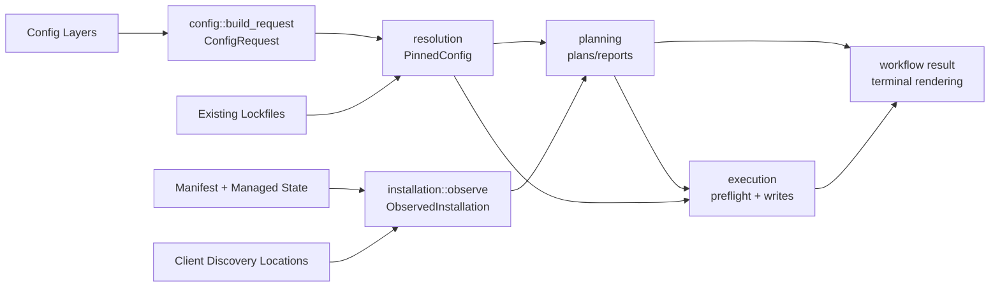
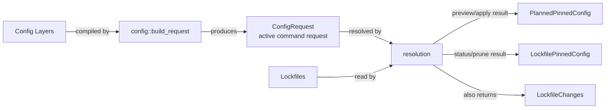
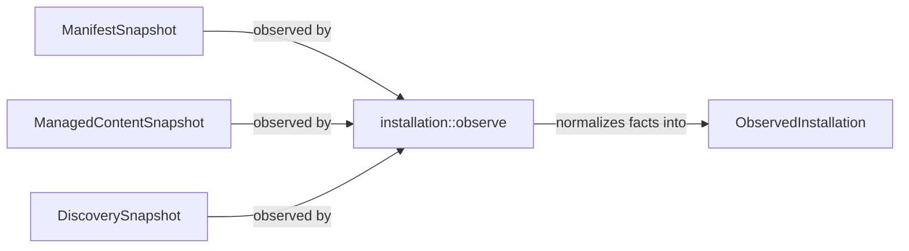
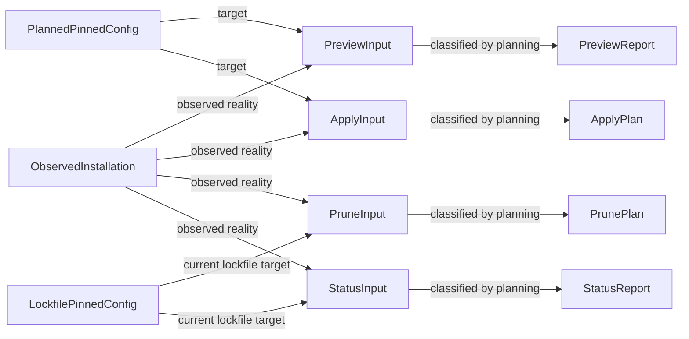
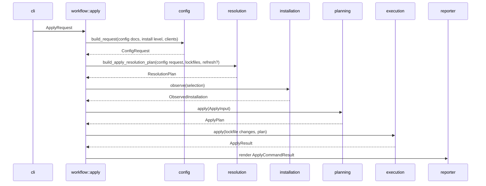

# V1 Design

## Thesis

V1 uses the Option 2B responsibility-module architecture. Commands first build a
`ConfigRequest`, then resolve that request into pinned configuration, observe the
current installation, plan command-specific results, and execute approved writes.

The design keeps generic infrastructure out of V1. V1 manages Skills. V2 can add
Subagents through typed sibling submodules beside Skills without introducing a
generic item trait, a generalized lifecycle engine, or shared lifecycle machinery
before the second item kind proves what is actually common.

The design is lightly inspired by `kubectl apply`'s declarative comparison of
requested configuration with live state, while keeping pruning as an explicit
separate command. It is also inspired by Cargo's lockfile model: resolve first,
persist the lock, then perform work against that persisted resolution.
References: [Kubernetes declarative object management](https://kubernetes.io/docs/tasks/manage-kubernetes-objects/declarative-config/)
and [cargo generate-lockfile](https://doc.rust-lang.org/cargo/commands/cargo-generate-lockfile.html).

Core split:

| Module | Role |
| --- | --- |
| `config/` | Parses active Config Layers and command options into `ConfigRequest`. |
| `resolution/` | Resolves Skill Sources and lockfiles into normalized `PinnedConfig` meaning. |
| `installation/` | Observes filesystem, Manifest, Managed State, and discovery-location facts as `ObservedInstallation`. |
| `planning/` | Classifies observed facts against pinned configuration and produces command reports or mutation plans. |
| `execution/` | Owns preflight, write ordering, and last-mile mutation safety. |
| `workflow/` | Orchestrates command use cases without owning domain policy. |
| `stores/` | Performs narrow persistence and external-source IO. |
| `fs/` | Provides filesystem probes and low-level filesystem operations. |
| `lockfile.rs` | Defines the persisted lockfile schema. |
| `manifest.rs` | Defines the persisted Manifest schema. |
| `client_registry.rs` | Defines supported Clients and Client Discovery Locations. |
| `content_digest.rs` | Defines deterministic tree digest rules. |

The diagram below shows the high-level data flow between those modules. It is a
conceptual overview; command-specific details are covered in the command flow
sections.



## Vocabulary

Use the following internal state names in the V1 design and implementation:

```text
ConfigRequest
PinnedConfig
LockfilePinnedConfig(PinnedConfig)
PlannedPinnedConfig(PinnedConfig)
ObservedInstallation
```

Meanings:

- `ConfigRequest`: normalized command-time request built from active Config
  Layers plus command options. It includes Install Level, selected Clients,
  Config Layer identity, and unresolved Skill Source selections.
- `PinnedConfig`: normalized resolved configuration after Skill Source refs,
  selected skills, groups, aliases, Discovery Names, content identities, and
  Discovery Requirements are fixed.
- `LockfilePinnedConfig(PinnedConfig)`: pinned configuration loaded from the
  current lockfiles and normalized by `resolution/`.
- `PlannedPinnedConfig(PinnedConfig)`: pinned configuration proposed by the
  current operation. `preview` keeps it in memory; `apply` writes matching
  lockfile changes before installing.
- `ObservedInstallation`: observed install reality from the filesystem,
  Manifest, Managed State, and Client Discovery Locations. It may drift from
  pinned configuration because local files can be changed outside `agentcfg`.

`lockfile.rs` owns persisted TOML shape. `resolution/` owns what a lockfile
record means after it becomes `PinnedConfig`. Planning and execution never use
lockfile schema types directly.

## Module Layout

Recommended Rust module layout:

```text
crates/agentcfg-cli/src/
  main.rs                 CLI entrypoint
  args.rs                 argument parsing into command requests
  output.rs               terminal rendering adapters
  exit_codes.rs           central exit-code mapping

crates/agentcfg-core/src/
  workflow/
    mod.rs
    init.rs               command use case
    preview.rs            command use case
    apply.rs              command use case
    prune.rs              command use case
    status.rs             command use case
    doctor.rs             readiness command use case

  config/
    mod.rs                config::build_request entrypoints
    skills.rs             Skill Configuration request model

  resolution/
    mod.rs                public pin/load entrypoints
    skills.rs             Skill Source resolution and pinned skill meaning

  installation/
    mod.rs                installation::observe entrypoint
    skills.rs             observed skill artifacts and content facts

  planning/
    mod.rs                public command-shaped planning entrypoints
    classifiers.rs        private shared classification logic
    preview.rs            PreviewReport shaping
    apply.rs              ApplyPlan shaping
    prune.rs              PrunePlan shaping
    status.rs             StatusReport shaping
    skills.rs             skill-specific planning rules

  execution/
    mod.rs                public apply/prune execution interface
    apply.rs              apply preflight and write ordering
    prune.rs              prune preflight and removal ordering
    skills.rs             skill materialization and discovery writes

  stores/
    config_store.rs       config file reads/writes
    lock_store.rs         lockfile reads/writes
    manifest_store.rs     Manifest reads/writes
    managed_content.rs    content-addressed Managed Skill Content writes
    discovery_store.rs    discovery symlink operations

  fs/
    filesystem_probe.rs   path kind, symlink, writability, directory facts

  lockfile.rs             persisted lockfile model
  manifest.rs             Manifest model
  client_registry.rs      supported clients and discovery locations
  content_digest.rs       deterministic tree digest
```

The layout is intentionally not one module per product noun. Modules exist where
they hide policy, normalize evidence, preserve persistence ownership, or reduce
caller burden.

When Subagent Configuration is added after V1, add typed sibling modules such as
`config/subagents.rs`, `resolution/subagents.rs`, `installation/subagents.rs`,
`planning/subagents.rs`, and `execution/subagents.rs`. Do not add those files in
V1 unless Subagent behavior is being implemented.

### Subagent V2 Path

Each responsibility module has typed item-specific siblings. V1 wires `skills.rs`.
V2 may wire `subagents.rs` beside it:

```text
config/skills.rs        config/subagents.rs
resolution/skills.rs    resolution/subagents.rs
installation/skills.rs  installation/subagents.rs
planning/skills.rs      planning/subagents.rs
execution/skills.rs     execution/subagents.rs
```

The parent modules coordinate command-level aggregation only. Shared behavior
must remain concrete until Skills and Subagents prove the same invariant needs
one abstraction. Do not add a generic item trait, generic pinning trait, or
generic planning trait in V1.

## CLI Layout

V1 keeps the CLI thin. It parses flags into typed command requests, calls the
matching `workflow` use case, renders the result, and maps it to an exit code.
It does not perform orchestration, source resolution, planning, or filesystem
mutation directly.

Command surface:

```text
agentcfg init [--project | --user]

agentcfg preview [--user] [--refresh-sources] [--client <client>...]
agentcfg apply   [--user] [--refresh-sources] [--client <client>...]

agentcfg prune   [--user] [--client <client>...]
agentcfg status  [--user] [--client <client>...]

agentcfg doctor
```

Request types:

```text
InitRequest {
  target_layer: UserProject | SharedProject | User,
}

PreviewRequest {
  install_level: Project | User,
  refresh_sources: bool,
  clients: ClientSelector,
}

ApplyRequest {
  install_level: Project | User,
  refresh_sources: bool,
  clients: ClientSelector,
}

PruneRequest {
  install_level: Project | User,
  clients: ClientSelector,
}

StatusRequest {
  install_level: Project | User,
  clients: ClientSelector,
}

DoctorRequest {}
```

CLI flag rules:

- Default `init` creates User Project Config.
- `init --project` creates Shared Project Config.
- `init --user` creates User Config.
- Default `preview`, `apply`, `prune`, and `status` run at Project Level.
- `--user` selects User Level for `preview`, `apply`, `prune`, and `status`.
- `doctor` has no `--user` because it checks environment/config/tooling
  readiness rather than one install level.
- `--refresh-sources` is accepted only by `preview` and `apply`.
- `--client <client>` may repeat and only narrows configured clients. It does
  not add clients outside configured selection unless config uses
  `clients = "all"`.

Workflow mapping:

```text
agentcfg init     -> workflow::init::run(InitRequest)
agentcfg preview  -> workflow::preview::run(PreviewRequest)
agentcfg apply    -> workflow::apply::run(ApplyRequest)
agentcfg prune    -> workflow::prune::run(PruneRequest)
agentcfg status   -> workflow::status::run(StatusRequest)
agentcfg doctor   -> workflow::doctor::run(DoctorRequest)
```

Output responsibilities:

- `workflow` returns structured command reports/results.
- `agentcfg-cli` renders terminal output from those structures.
- Exit code mapping stays centralized in `exit_codes.rs`.
- CLI help and diagnostics use PRD terms: Config Layer, Install Level, Skill
  Source, Client Discovery Location, Managed State, Manifest, Discovery
  Requirement, Installed Artifact, and Discovery Name Collision.

## Data Shapes

Use typed aggregate state, not optional future bags.

```text
ConfigRequest {
  install_level: Project | User,
  clients: SelectedClients,
  layers: Vec<ConfigLayerRequest>,
  skills: config::skills::SkillConfigRequest,
}

PinnedConfig {
  install_level: Project | User,
  clients: SelectedClients,
  skills: resolution::skills::PinnedSkills,
}

LockfilePinnedConfig(PinnedConfig)
PlannedPinnedConfig(PinnedConfig)

ObservedInstallation {
  install_level: Project | User,
  clients: SelectedClients,
  skills: installation::skills::ObservedSkills,
  manifest: ManifestSnapshot,
  reference_context: InstallationReferenceContext,
}
```

If V2 adds Subagents, extend the aggregate explicitly:

```text
ConfigRequest {
  skills: config::skills::SkillConfigRequest,
  subagents: config::subagents::SubagentConfigRequest,
}

PinnedConfig {
  skills: resolution::skills::PinnedSkills,
  subagents: resolution::subagents::PinnedSubagents,
}

ObservedInstallation {
  skills: installation::skills::ObservedSkills,
  subagents: installation::subagents::ObservedSubagents,
}
```

Do not model V2 by adding a map of generic item kind to opaque data. The typed
sibling modules keep ownership clear and keep callers from handling downcasts,
generic IDs, or policy switches.

### Data Structure Concept Islands

These diagrams split the main data structures by ownership. They are about data
relationships, not exact function call order.

#### Config And Pinning



#### Installation Observation



#### Planning Inputs And Outputs



#### Execution And Manifest State


## Config File Shape

`ConfigDoc` is the parsed persisted schema for one Config Layer file. Persisted
Config Layer files use compact TOML field names where nesting already supplies
the Skill Configuration context. These persisted names are part of the V1 design
contract: `config-layer`, `include`, `groups`, and `aliases`.

Example:

```toml
config-layer = "user-project"
clients = ["codex", "cursor"]

[[skills.sources]]
id = "team"
path = "../skills"
include = ["review"]
groups = ["rust"]
aliases = { review = "project-review" }
```

`config-layer` stores a Persisted Config Layer Value: `shared-project`,
`user-project`, or `user`. `include`, `groups`, and `aliases` are per-Skill
Source fields. `aliases` stores Skill Alias rules from Source Skill Name to
Discovery Name.

Omitted `include`, `groups`, and `aliases` fields default to empty. `path` and
`git` are mutually exclusive Skill Source locator fields; config validation
enforces that exactly one is present.

## Command Composition Types

Command use cases compose config request building, resolution, installation
observation, planning, execution, and reporting through command-level types.
These types keep source and lockfile diagnostics outside installation
observation while still giving reporters one coherent command result.

```text
ResolutionPlan {
  planned_pinned: PlannedPinnedConfig,
  lockfile_changes: LockfileChanges,
  diagnostics: Vec<ResolutionDiagnostic>,
  blocking_diagnostics: Vec<BlockingConfigRequestDiagnostic>,
}

LockfileConfigCheck {
  lockfile_pinned: LockfilePinnedConfig,
  diagnostics: Vec<ResolutionDiagnostic>,
  blocking_diagnostics: Vec<BlockingConfigRequestDiagnostic>,
}

PreviewCommandPlan {
  resolution_plan: ResolutionPlan,
  preview: PreviewReport,
}

ApplyCommandPlan {
  lockfile_changes: LockfileChanges,
  apply_plan: ApplyPlan,
}

CommandExecutionOutcome<T> {
  BlockedBeforeExecution,
  Executed(T),
}

ApplyCommandResult {
  plan: ApplyCommandPlan,
  outcome: CommandExecutionOutcome<ApplyResult>,
}

PruneCommandPlan {
  lockfile_check: LockfileConfigCheck,
  prune_plan: PrunePlan,
}

PruneCommandResult {
  plan: PruneCommandPlan,
  outcome: CommandExecutionOutcome<PruneResult>,
}

StatusCommandReport {
  lockfile_check: LockfileConfigCheck,
  status: StatusReport,
}

DoctorCommandReport {
  readiness: DoctorReport,
}
```

`ResolutionDiagnostic` includes source-resolution, lockfile-read, and
config/lock mismatch evidence. Workflows keep these diagnostics alongside
planning results so reporters can render command-specific warnings and blockers
without making planning own source or lockfile policy.

## Module Responsibilities

### `config/`

Builds the command-time request from parsed config and CLI options.

```text
config::build_request(config_docs, install_level, clients) -> ConfigRequest
```

Owns:

- active Config Layer selection
- Project Level vs User Level separation
- `--client` narrowing
- `clients = "all"` expansion through `client_registry.rs`
- persisted config schema validation that does not require source contents
- Config Layer identity and path normalization
- unresolved Skill Source locators, selections, groups, and aliases

Does not inspect git/path source contents, read lockfile contents, read
discovery locations, or classify install state.

### `resolution/`

Converts `ConfigRequest` and lockfiles into normalized pinned configuration.

```text
resolution::build_preview_resolution_plan(request, lockfiles, refresh_sources) -> ResolutionPlan
resolution::build_apply_resolution_plan(request, lockfiles, refresh_sources) -> ResolutionPlan
resolution::check_status_lockfiles(request, lockfiles) -> LockfileConfigCheck
resolution::check_prune_lockfiles(request, lockfiles) -> LockfileConfigCheck
```

Owns:

- existing lock reuse
- missing lockfile creation planning
- `--refresh-sources`
- path and git Skill Source resolution
- Skill Source discovery
- Skill Group expansion
- Included Skill validation
- Skill Alias application
- Managed Skill Content preparation inputs
- content digest calculation through `content_digest.rs`
- normalized Discovery Requirement and Installed Artifact meaning
- config/lock mismatch evidence
- source-resolution diagnostics

Does not read ObservedInstallation, classify blockers/skips, or decide
apply/prune/status policy.

`resolution/skills.rs` is the V1 owner for pinned skill meaning.
`resolution/subagents.rs` is the reserved V2 sibling for pinned subagent meaning.

### `installation/`

Reads current evidence and normalizes it into `ObservedInstallation`.

```text
installation::observe(selection) -> ObservedInstallation
```

It scans entire selected Client Discovery Locations, not only pinned paths. The
selection is still limited to the active Install Level and selected Clients.

Owns observable facts:

- Manifest records
- Managed Skill Content existence
- discovery path entries
- unmanaged artifacts
- symlink targets
- broken symlinks
- unexpected symlink target evidence
- directory emptiness
- global Managed State references needed for safe selected-client prune

It may read global Manifest state to answer safety questions such as whether a
shared artifact still has requirements from other clients, but it returns an
`ObservedInstallation` limited to the selected Install Level and Clients and
enriched with reference context.

It does not decide whether something is stale, removable, blocked, or a warning.

### `planning/`

Owns lifecycle policy, classification, and command-specific planning.

```text
planning::preview(PreviewInput) -> PreviewReport
planning::apply(ApplyInput) -> ApplyPlan
planning::prune(PruneInput) -> PrunePlan
planning::status(StatusInput) -> StatusReport
```

Inputs:

```text
PreviewInput {
  planned_pinned: PlannedPinnedConfig,
  observed_installation: ObservedInstallation,
}

ApplyInput {
  planned_pinned: PlannedPinnedConfig,
  observed_installation: ObservedInstallation,
}

PruneInput {
  lockfile_pinned: LockfilePinnedConfig,
  observed_installation: ObservedInstallation,
}

StatusInput {
  lockfile_pinned: LockfilePinnedConfig,
  observed_installation: ObservedInstallation,
}
```

Private classifiers are shared inside the module so command behavior does not
drift:

- Discovery Name Collisions after pinning
- missing pinned artifacts
- artifact updates
- stale Discovery Requirements
- stale Installed Artifacts
- unsatisfied Discovery Requirements
- unexpected symlink targets
- broken symlinks
- unmanaged artifact conflicts
- config/lock mismatch findings
- apply blockers
- prune skips
- status health findings
- doctor readiness findings

Public outputs remain command-specific. Callers do not depend on private
classifier types.

### `execution/`

Owns mutation ordering, private preflight, and last-mile filesystem safety.

Public interface:

```text
execution::apply(lockfile_changes, plan) -> ApplyResult
execution::prune(plan) -> PruneResult
```

Preflight is private. Callers should not need to remember to preflight before
execution.

`apply()` behavior:

1. run all-or-nothing preflight
2. if preflight fails, return a no-change blocked result
3. write lockfile changes
4. materialize Managed Skill Content
5. create/update discovery symlinks
6. update Manifest / Discovery Requirements last

`prune()` behavior:

1. preflight each stale removal
2. remove safe stale requirements/artifacts
3. skip unsafe removals
4. return structured skipped/failure diagnostics

Execution knows the plan shape and safe write ordering. Low-level stores and
filesystem adapters own symlink, TOML, Manifest, and content persistence
mechanics.

### `workflow/`

Owns command orchestration only.

Workflow modules:

- load config and lockfiles through `stores/`
- call `config::build_request`
- call `resolution/` when the command needs pinned configuration
- call `installation::observe` when the command needs installation facts
- call `planning/`
- call `execution/` for mutating commands
- return structured command results to the CLI

Workflow modules do not classify install findings, interpret lockfile schema, or
perform filesystem writes directly.

### Stores, Filesystem, And Helpers

Shared low-level modules:

- `client_registry.rs`: supported clients and discovery locations
- `content_digest.rs`: deterministic tree digest rules
- `stores/config_store.rs`: config file reads/writes
- `stores/lock_store.rs`: lockfile reads/writes
- `stores/manifest_store.rs`: Manifest reads/writes
- `stores/managed_content.rs`: content-addressed Managed Skill Content writes
- `stores/discovery_store.rs`: discovery symlink operations
- `stores/source_store.rs`: path/git Skill Source reads
- `fs/probe.rs`: path kind, symlink, writability, directory emptiness
- `fs/ops.rs`: narrow filesystem operations

These modules should return structured facts or perform narrow persistence
operations. They should not encode command policy.

## Command Flows

All command flows enter the core through `workflow::*::run`. Commands that need
active configuration use `config::build_request` to normalize command options
and active ConfigDocs. Only commands that need pinned configuration call
`resolution/`. Only commands that compare install reality call
`installation::observe`. Apply and Prune call `execution/` only after planning.

### Init

`init` creates an empty Config Layer file. It does not resolve Skill Sources or
observe Client Discovery Locations because no pinned configuration or install
state exists yet.

```text
determine the ConfigDoc path for init.target_layer
if that ConfigDoc path already exists:
  report and stop

stores::config_store.create_config_doc_file(init.target_layer)
reporter.render_init(success)
```

Init refuses to overwrite an existing config file unless a later command design
explicitly adds a safe overwrite mode.

### Preview

`preview` is a read-only forecast, not a reserved transaction.

```text
config_docs = stores::config_store.load_active_config_docs(...)
request = config::build_request(config_docs, preview.install_level, preview.clients)
lockfiles = stores::lock_store.load_for_config_docs(config_docs)
resolution_plan = resolution::build_preview_resolution_plan(request, lockfiles, refresh_sources)
observed = installation::observe(selection)
install_preview = planning::preview({
  planned_pinned: resolution_plan.planned_pinned,
  observed_installation: observed,
})
reporter.render_preview({ resolution_plan, install_preview })
```

Preview shows:

- lockfile changes that would be created or updated
- Skill Source resolutions
- apply creates/updates
- apply blockers
- stale requirements/artifacts that prune would remove
- prune skips
- Discovery Name preparation
- warnings for uncertain Client Discovery Locations

Preview does not write config, lockfiles, Manifest, Managed State, Skill
Sources, or discovery locations.

### Apply

`apply` recomputes resolution at apply time. If sources changed since preview,
apply uses the apply-time resolution. Future applies then use the persisted lock
unless refresh is requested.

This diagram shows the successful apply path. Planning blockers stop before
execution mutation.



```text
config_docs = stores::config_store.load_active_config_docs(...)
request = config::build_request(config_docs, apply.install_level, apply.clients)
lockfiles = stores::lock_store.load_for_config_docs(config_docs)
resolution_plan = resolution::build_apply_resolution_plan(request, lockfiles, refresh_sources)
observed = installation::observe(selection)
install_plan = planning::apply({
  planned_pinned: resolution_plan.planned_pinned,
  observed_installation: observed,
})

if install_plan has apply blockers:
  reporter.render_apply({
    plan: { lockfile_changes: resolution_plan.lockfile_changes, install_plan },
    outcome: BlockedBeforeExecution,
  })
  exit 2

execution = execution::apply(resolution_plan.lockfile_changes, install_plan)
reporter.render_apply({
  plan: { lockfile_changes: resolution_plan.lockfile_changes, install_plan },
  outcome: Executed(execution),
})
```

Apply does not knowingly partially proceed. If planning reports semantic apply
blockers, no mutation is attempted. If execution preflight fails, no mutation is
attempted. Last-mile failures can still leave partial state; recovery is
forward/idempotent through `status`, fixes, and rerun.

Apply never prunes. If stale state remains, apply reports the PRD warning to run
`agentcfg prune`.

### Prune

```text
config_docs = stores::config_store.load_active_config_docs(...)
request = config::build_request(config_docs, prune.install_level, prune.clients)
lockfiles = stores::lock_store.load_for_config_docs(config_docs)
lockfile_check = resolution::check_prune_lockfiles(request, lockfiles)
observed = installation::observe(selection)
prune_plan = planning::prune({
  lockfile_pinned: lockfile_check.lockfile_pinned,
  observed_installation: observed,
})
execution = execution::prune(prune_plan)
reporter.render_prune({
  plan: { lockfile_check, prune_plan },
  outcome: Executed(execution),
})
```

Prune may partially proceed. It removes safe stale state and skips unsafe stale
removals. If skips remain, exit `2` with recovery guidance.

### Status

```text
config_docs = stores::config_store.load_active_config_docs(...)
request = config::build_request(config_docs, status.install_level, status.clients)
lockfiles = stores::lock_store.load_for_config_docs(config_docs)
lockfile_check = resolution::check_status_lockfiles(request, lockfiles)
observed = installation::observe(selection)
install_status = planning::status({
  lockfile_pinned: lockfile_check.lockfile_pinned,
  observed_installation: observed,
})
reporter.render_status({ lockfile_check, install_status })
```

Status answers two related questions:

- Does ObservedInstallation match `LockfilePinnedConfig`?
- Does the existing pinned configuration still represent active config, or is
  there config/lock mismatch?

Config/lock mismatch evidence comes from `resolution/`. Status classification
and wording come from `planning/`.

### Doctor

Doctor checks readiness. It is read-only and does not replace `status` for
install-state consistency.

```text
load available ConfigDocs and local environment evidence
readiness_inputs = { config_docs, client_registry evidence, filesystem probes }
readiness = workflow::doctor readiness checks
reporter.render_doctor({ readiness })
```

Doctor checks:

- git availability
- Project Root detection
- supported clients
- client discovery location confidence
- config schema validity
- path writability
- optional source/network checks when requested or configured
- unmanaged artifacts only when they block known readiness paths

Doctor does not write lockfiles, Manifest, Managed State, Skill Sources, or
discovery locations. It does not call `execution/`.

## Preview And Reporting Terms

Use precise command-impact terms.

- **Apply blockers**: conditions that prevent `apply` from executing any
  planned mutations.
- **Prune skips**: stale removals that `prune` will skip while continuing with
  other safe removals.
- **Status findings**: install-state consistency facts.
- **Config/lock mismatch**: active config asks for source/selection/client
  intent that existing lockfiles do not represent.

Partial and blocked outcomes must include structured recovery diagnostics:

```text
Refusal {
  path,
  reason,
  required_by,
  expected_action,
  recovery_steps,
}
```

Exit codes:

- `0`: full success
- `1`: fatal command/config/environment error before meaningful planning or
  execution
- `2`: command completed or planned, but convergence/cleanup was blocked or
  skipped

Document exit codes in user-facing command docs. Keep code comments centralized
at exit-code mapping.

## Lockfile Model

`lockfile.rs` owns the persisted lockfile schema only. It defines TOML-facing
records, field names, versioning, and parse/serialize behavior.

`resolution/` owns conversion between lockfile records and `PinnedConfig`.
Callers outside `resolution/` should not make decisions from raw lockfile
records.

Lockfile responsibilities:

- preserve stable persisted field names
- preserve lockfile versioning and migration hooks
- represent source pins for path and git Skill Sources
- represent selected Source Skill Names, Discovery Names, prepared content
  identities, and source provenance required for repeatability
- avoid duplicating Manifest ownership state

Lockfile non-responsibilities:

- no filesystem observation
- no stale artifact classification
- no write ordering
- no command reporting policy

## Manifest Model

The Manifest separates Installed Artifacts from Discovery Requirements.

```text
Manifest {
  installed_artifacts: Map<ArtifactKey, InstalledArtifact>,
  discovery_requirements: Map<RequirementKey, DiscoveryRequirement>,
}
```

Artifact identity is physical discovery identity:

```text
ArtifactKey {
  install_level,
  client_discovery_location,
  discovery_name,
}
```

`ArtifactKey` excludes client, Config Layer, and digest. Multiple clients and
layers can require the same physical artifact. Digest is artifact state; a
changed digest means update the artifact.

Requirement identity is who requires the artifact:

```text
RequirementKey {
  config_layer,
  install_level,
  client,
  client_discovery_location,
  discovery_name,
}
```

`RequirementKey` excludes digest. Required digest is requirement state.

```text
InstalledArtifact {
  key: ArtifactKey,
  discovery_path,
  target,
  digest: TreeDigest,
}

DiscoveryRequirement {
  key: RequirementKey,
  artifact_key: ArtifactKey,
  required_digest: TreeDigest,
  pinned_skill_ref: PinnedSkillRef,
}
```

`DiscoveryRequirement` stores minimal provenance for reporting only. It does not
duplicate source URL/path/git ref resolution from lockfiles.

```text
PinnedSkillRef {
  config_source_id,
  source_skill_name,
  discovery_name,
}
```

Prune removes stale Discovery Requirements first. It removes an Installed
Artifact only when no Discovery Requirements remain for its `ArtifactKey`.

## Managed Skill Content

Managed Skill Content is content-addressed by prepared content digest.

```text
Managed State/content/skills/sha256/2a/2a56c8...fed/
Client Discovery Location/review -> Managed State/content/skills/sha256/2a/2a56c8...fed/
```

Prepared content includes alias/frontmatter preparation. If preparation changes
bytes, it naturally produces a different digest.

Discovery artifacts are symlinks to content-addressed Managed Skill Content.
Copy mode is not a first-class V1 install mode unless a client/platform forces
it later.

Content addressing deduplicates within one Managed State root. V1 does not
deduplicate project-level Managed Skill Content across different projects or
between project and user Managed State roots.

## Successful State Example

This example uses placeholders for Managed State roots. The exact Managed State
path is a persistence contract to define alongside implementation; the important
shape is that Client Discovery Locations point to content-addressed Managed
Skill Content.

Project-level state after `agentcfg apply`:

```text
<project-root>/
  agentcfg.toml                         Shared Project Config
  agentcfg.lock                         Shared Project Config lockfile
  .agentcfg/
    config.toml                         User Project Config
    lock.toml                           User Project Config lockfile
  .agents/
    skills/
      review -> <project-managed-state>/content/skills/sha256/2a/2a56c8...fed/
      test   -> <project-managed-state>/content/skills/sha256/9f/9fb12e...071/
  .claude/
    skills/
      review -> <project-managed-state>/content/skills/sha256/2a/2a56c8...fed/

<project-managed-state>/
  manifest.toml
  content/
    skills/
      sha256/
        2a/
          2a56c8...fed/
            SKILL.md
            ...
        9f/
          9fb12e...071/
            SKILL.md
            ...
```

User-level state after `agentcfg apply --user`:

```text
${XDG_CONFIG_HOME:-~/.config}/agentcfg/
  config.toml                           User Config
  lock.toml                             User Config lockfile

~/.agents/
  skills/
    personal-review -> <user-managed-state>/content/skills/sha256/c4/c4926a...8d3/

~/.claude/
  skills/
    personal-review -> <user-managed-state>/content/skills/sha256/c4/c4926a...8d3/

<user-managed-state>/
  manifest.toml
  content/
    skills/
      sha256/
        c4/
          c4926a...8d3/
            SKILL.md
            ...
```

Shared portable discovery paths can produce multiple Discovery Requirements for
one Installed Artifact. For example, Codex, Pi, OpenCode, and Cursor may all
require `.agents/skills/review`, but the physical artifact is one symlink keyed
by its discovery location and Discovery Name.

Compact Manifest excerpt for the project-level `review` example:

```text
[installed_artifacts."project:.agents/skills:review"]
discovery_path = ".agents/skills/review"
target = "<project-managed-state>/content/skills/sha256/2a/2a56c8...fed"
digest = "sha256:2a56c8...fed"

[discovery_requirements."SharedProject:project:Codex:.agents/skills:review"]
artifact_key = "project:.agents/skills:review"
required_digest = "sha256:2a56c8...fed"
pinned_skill_ref = { config_source_id = "team-skills", source_skill_name = "review", discovery_name = "review" }

[discovery_requirements."SharedProject:project:Cursor:.agents/skills:review"]
artifact_key = "project:.agents/skills:review"
required_digest = "sha256:2a56c8...fed"
pinned_skill_ref = { config_source_id = "team-skills", source_skill_name = "review", discovery_name = "review" }
```

## Content Digest

`content_digest.rs` owns deterministic tree digest rules.

```text
TreeDigest {
  algorithm: "sha256",
  value,
}
```

Canonical digest includes:

- relative paths in sorted order
- file bytes
- file type
- symlink target if symlinks are preserved after materialization
- normalized executable bit if preserved

Canonical digest excludes:

- mtimes
- uid/gid
- platform-specific metadata
- absolute source paths

Used by:

- `resolution/` to identify pinned content
- materialization verification
- `installation/` recovery checks
- `execution/` recovery before recording ownership
- tests

It does not know about Skills, Manifest, or command policy.

## Safety And Recovery

Default conflict recourse is refusal, not overwrite/adopt/delete.

V1 does not provide:

- `--force`
- `--overwrite-unmanaged`
- `--adopt-existing`
- transactional rollback
- autoprune on apply

User influence happens before rerun through:

- `--client`
- config client selection
- Skill Alias / Discovery Name changes
- manual filesystem cleanup

Safety ownership:

```text
installation::observe:
  observes filesystem facts

planning:
  classifies semantic blockers, skips, removability, and status findings

execution:
  preflights write readiness and revalidates immediately before mutation

lockfile.rs:
  owns persisted lockfile schema

resolution:
  owns normalized pinned meaning
```

Examples:

- unmanaged artifact at requested path: apply blocker
- unexpected symlink target on stale artifact: prune skip
- broken symlink: status finding; apply may replace only if ownership is clear
- directory deletion: allowed only when stale, manifest-owned, unreferenced, and
  empty

If an artifact creation succeeds but Manifest update fails, rerun `apply` may
record Manifest ownership only when the existing artifact exactly matches the
current `ApplyPlan`:

- symlink target equals expected content-addressed Managed Skill Content path,
  or copied content digest matches if copy mode exists
- Managed Skill Content digest equals expected `TreeDigest`
- expected digest comes from the current plan

This is interrupted-write recovery, not general unmanaged adoption.

## Design Guardrails

- Do not add a generic item trait for V1.
- Do not add a generic lifecycle engine for V1.
- Do not expose internal item IDs as public contracts.
- Do not make `ApplyPlan` an executable filesystem script.
- Do not put source resolution or lockfile mechanics in `planning/`.
- Do not put lifecycle policy in `execution/`.
- Do not put persisted lockfile interpretation outside `resolution/`.
- Do not duplicate filesystem probing between preview/apply/status/doctor;
  share evidence modules.
- Do not treat unmanaged artifacts as managed artifacts.
- Do not make every product noun a module. Modules must protect invariants,
  reduce caller burden, or improve locality.
